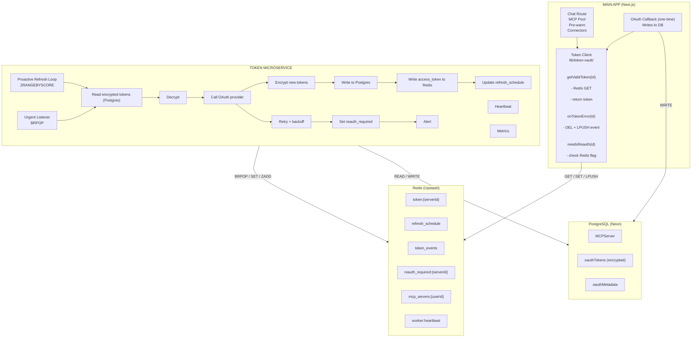
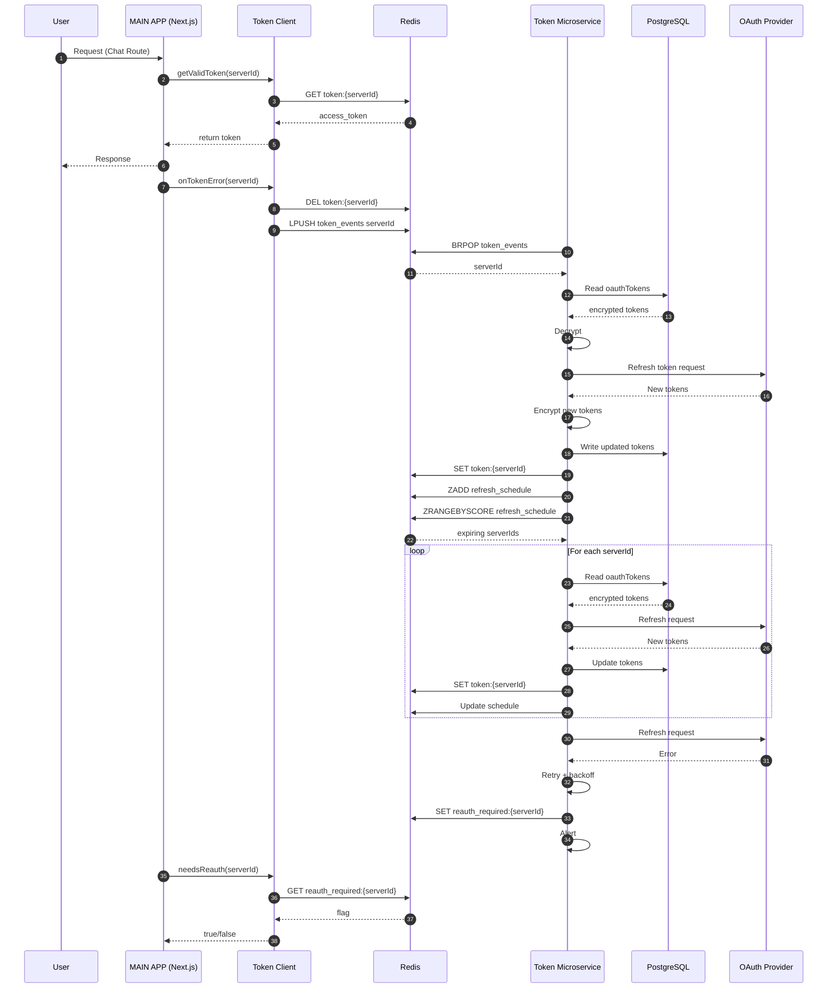

**Technical Architecture for Complete Token Abstraction via Redis-Mediated Microservice**

---

## What This Document Is

This document describes an architecture where token management is a **completely separate service** from the main Next.js application. The two systems never communicate directly, Redis sits between them as the sole mediating layer. The main app becomes a pure token consumer. It asks Redis for a token, gets one, uses it. It never refreshes, never decrypts, never checks expiry, never talks to OAuth providers.

This is the **Token Vending Machine (TVM) pattern**: the main app is the customer, Redis is the vending machine shelf, and the Token Service is the restocking crew. The customer puts in a serverId, gets back an access_token, and has no knowledge of the supply chain.

---

## The Vending Machine Pattern

### The Analogy

| Vending Machine Concept  | Token System Equivalent                                    |
| ------------------------ | ---------------------------------------------------------- |
| Customer                 | The Next.js main app                                       |
| Product on the shelf     | A valid `access_token` sitting in Redis                    |
| Coin slot (input)        | `serverId` used as the Redis key                           |
| Vending machine shelf    | Redis — pre-stocked with valid tokens                      |
| Restocking crew          | Token Service — a separate long-lived process              |
| Restocking schedule      | Proactive refresh loop (every 30-60 seconds)               |
| Emergency restock button | Urgent refresh signal via Redis queue on 401               |
| Warehouse                | PostgreSQL — encrypted long-term token storage             |
| “Out of stock” sign      | `reauth_required:{serverId}` flag in Redis                 |
| Refilling the warehouse  | OAuth callback — the only time new tokens enter the system |

### The Core Principle

The customer (main app) does not:

- Know where the products come from (OAuth providers)
- Know how often the shelf is restocked (refresh frequency)
- Know what the products are made of (refresh tokens, client secrets, token endpoints)
- Help with restocking (never calls refresh endpoints)
- Manage inventory (never checks expiry)

The customer does:

- Check the shelf for a product (Redis GET)
- Use the product (attach access_token as Authorization header)
- Report a defective product (signal a 401 via Redis queue)
- See the “out of stock” sign and go to customer service (show reconnect prompt when reauth_required is set)

### Block Diagram



### Where This Pattern Comes From

The Token Vending Machine pattern is established in cloud infrastructure:

- **AWS IoT Token Vending Machine**: A service that issues temporary AWS credentials to IoT devices. Devices request credentials, get them, use them. They never know about IAM roles, STS, or federation.
- **Azure Valet Key Pattern**: A pattern where clients receive short-lived, scoped access tokens from a dedicated service. The client uses the token to access resources directly without the application proxying every request. Microsoft documents this as a first-class cloud architecture pattern for offloading credential management.
- **HashiCorp Vault Dynamic Secrets**: Vault generates short-lived database credentials on demand. Applications request credentials via a simple API, use them, and never manage lifecycle. Vault handles rotation, revocation, and lease renewal.

The common thread: **a dedicated, purpose-built service owns the entire credential lifecycle, and consumers interact only through a minimal dispensing interface.**

---

## Why Redis-Mediated (No Direct HTTP)

The main app and the Token Service never make HTTP calls to each other. Redis is the sole communication layer. This is a deliberate architectural decision, not a convenience.

### Problems with direct HTTP between services

| Problem                                                                                                                                                                                              | Impact                                                 |
| ---------------------------------------------------------------------------------------------------------------------------------------------------------------------------------------------------- | ------------------------------------------------------ |
| The main app runs on Vercel (serverless). Outbound HTTP calls from serverless functions add cold-start latency and are subject to timeout limits.                                                    | Extra 10-50ms per token fetch, plus potential timeouts |
| Service-to-service authentication. If the Token Service exposes an API, it needs its own auth layer — API keys, mTLS, or JWT verification. That is another surface to manage and secure.             | Added complexity and attack surface                    |
| Coupling. If the Token Service API changes (new endpoint, changed response format), the main app must be updated and redeployed in sync.                                                             | Deployment coupling between two independent systems    |
| Single point of failure. If the Token Service API is down, the main app cannot get tokens.                                                                                                           | Availability risk                                      |
| The self-call anti-pattern already exists in the codebase (MCP pool calling its own refresh API). Replacing one HTTP call with another HTTP call to a different service solves nothing structurally. | Repeating the same mistake                             |

### Why Redis eliminates these problems

| Property                                                                                                                                                             | Benefit                                                               |
| -------------------------------------------------------------------------------------------------------------------------------------------------------------------- | --------------------------------------------------------------------- |
| Redis is always-on shared memory. Both services read and write independently. Neither needs the other to be running at the exact same moment.                        | Temporal decoupling — services don’t need to be online simultaneously |
| No API contract between services. The contract is the Redis key schema — a set of key patterns and value formats. This is simpler and more stable than an HTTP API.  | Minimal coupling                                                      |
| Redis GET is 1-3ms from Vercel’s edge. An HTTP call to a separate service would be 10-50ms minimum depending on region.                                              | Lower latency                                                         |
| If the Token Service is down, tokens that are already in Redis continue to be served. The main app doesn’t notice until tokens actually expire and aren’t restocked. | Graceful degradation                                                  |
| Upstash Redis is a managed service with 99.99% uptime SLA, encryption at rest and in transit, and automatic failover.                                                | Reliability without operational burden                                |

### What the Redis layer is NOT

- It is not a message broker. The system does not depend on guaranteed delivery of events. If an event is lost, the proactive refresh loop catches it within 30-60 seconds.
- It is not a database. Tokens in Redis are a cache with TTLs. PostgreSQL remains the source of truth for encrypted tokens.
- It is not a complex pub/sub system. The system uses simple data structures: `GET/SET` for token dispensing, `LPUSH/BRPOP` for event signaling, sorted sets for scheduling.

---

## Architecture Overview



---

## The Redis Protocol

This section defines every Redis key, its purpose, its value format, and which system reads and writes it. This key schema IS the contract between the two services — there is no other interface.

### Token Dispensing

| Key        | `token:{serverId}`                                                                                                                                                                                                                                |
| ---------- | ------------------------------------------------------------------------------------------------------------------------------------------------------------------------------------------------------------------------------------------------- |
| Value      | Plaintext access_token string                                                                                                                                                                                                                     |
| TTL        | Token’s remaining lifetime minus a 5-minute safety buffer. For a 1-hour Google token refreshed at the 50-minute mark, TTL = ~55 minutes.                                                                                                          |
| Written by | Token Service — after every successful refresh                                                                                                                                                                                                    |
| Read by    | Main App — via `getValidToken(serverId)`                                                                                                                                                                                                          |
| Deleted by | Main App — when a 401 is received (forces the service to restock). Token Service — before writing a new value (atomic replacement via SET EX).                                                                                                    |
| On miss    | Main App signals the Token Service via `token_events` queue and polls for up to 3 seconds. If still missing, the main app reads from PostgreSQL as an emergency fallback (does NOT refresh — just reads and decrypts the existing token from DB). |

### Token Metadata

| Key        | `token_meta:{serverId}`                                                                                                                                 |
| ---------- | ------------------------------------------------------------------------------------------------------------------------------------------------------- | --------- | ---------------------------------------------------------- |
| Value      | JSON object: `{ "expires_at": <unix_ms>, "provider": "google                                                                                            | microsoft | notion", "user_id": "<uuid>", "has_refresh_token": true }` |
| TTL        | Same as `token:{serverId}`                                                                                                                              |
| Written by | Token Service                                                                                                                                           |
| Read by    | Token Service (for scheduling decisions). Main App does NOT read this — it only reads `token:{serverId}`.                                               |
| Purpose    | Allows the Token Service to make decisions about refresh timing and provider-specific behavior without reading from PostgreSQL on every loop iteration. |

### Refresh Schedule

| Key        | `refresh_schedule` (sorted set)                                                                                                                                             |
| ---------- | --------------------------------------------------------------------------------------------------------------------------------------------------------------------------- |
| Members    | `serverId` strings                                                                                                                                                          |
| Scores     | `expires_at` timestamps (Unix milliseconds)                                                                                                                                 |
| Written by | Token Service — updates score after each refresh. Main App — adds a new member after OAuth callback creates a new server.                                                   |
| Read by    | Token Service — `ZRANGEBYSCORE refresh_schedule -inf {now + 10 minutes}` to find tokens that need proactive refresh.                                                        |
| Removed by | Token Service — `ZREM` when a server is deleted or when `reauth_required` is set (stops trying to refresh a dead token). Main App — `ZREM` when a user deletes a connector. |
| Purpose    | The Token Service’s work queue. Replaces polling the database for expiring tokens.                                                                                          |

### Event Queue (Urgent Signals)

| Key                 | `token_events` (Redis list, used as a queue)                                                                                                                                                                                                 |
| ------------------- | -------------------------------------------------------------------------------------------------------------------------------------------------------------------------------------------------------------------------------------------- |
| Value               | JSON objects pushed via `LPUSH`. Each has a `type` and `serverId`.                                                                                                                                                                           |
| Event types         | `"invalidate"` — main app received a 401, needs immediate refresh. `"new"` — main app created a new MCP server via OAuth, tokens are in DB and need to be loaded into Redis. `"delete"` — main app deleted a connector, clean up Redis keys. |
| Written by          | Main App                                                                                                                                                                                                                                     |
| Read by             | Token Service — via `BRPOP token_events 5` (blocking pop with 5-second timeout). The service processes events between proactive refresh cycles.                                                                                              |
| Purpose             | Allows the main app to signal the Token Service without HTTP. The `BRPOP` is blocking, so the service responds to urgent events within seconds, not on the next cron tick.                                                                   |
| On service downtime | Events accumulate in the list. When the service restarts, it drains the queue. Events are simple and idempotent — processing a stale “invalidate” event just triggers an unnecessary refresh, which is harmless.                             |

### Reauth Required Flag

| Key        | `reauth_required:{serverId}`                                                                                                                                                                                                     |
| ---------- | -------------------------------------------------------------------------------------------------------------------------------------------------------------------------------------------------------------------------------- | -------------- | ----------------------------------------------------------------------------------- |
| Value      | JSON: `{ "reason": "refresh_token_revoked                                                                                                                                                                                        | provider_error | max_retries_exceeded", "failed_at": <unix_ms>, "server_name": "Google Workspace" }` |
| TTL        | 24 hours (auto-clears — if the user hasn’t reconnected in 24 hours, the flag reappears on the next refresh attempt as the service will try and fail again).                                                                      |
| Written by | Token Service — after N consecutive refresh failures for the same server.                                                                                                                                                        |
| Read by    | Main App — checked by `getValidToken()` when Redis cache is empty. If this flag is set, `getValidToken()` throws a `ReauthenticationRequired` error instead of waiting for a refresh. The app shows a one-time reconnect prompt. |
| Deleted by | Main App — after the user successfully re-authorizes via OAuth callback. The `storeTokens()` path deletes this flag.                                                                                                             |
| Purpose    | The only mechanism by which a token-related issue surfaces to the user. This replaces all current token error UI (loading overlays, expired banners, AI refresh tools, data stream error events).                                |

### Server List Cache

| Key            | `mcp_servers:{userId}`                                                                                                                                       |
| -------------- | ------------------------------------------------------------------------------------------------------------------------------------------------------------ |
| Value          | JSON array of server metadata objects (id, name, url, transportType, enabled, enabledTools). NO tokens — tokens are always retrieved via `token:{serverId}`. |
| TTL            | 5 minutes                                                                                                                                                    |
| Written by     | Main App — on cache miss, after querying PostgreSQL.                                                                                                         |
| Read by        | Main App — on every chat message and pre-warm, before fetching individual tokens.                                                                            |
| Invalidated by | Main App — on any MCP server create, update, delete, or toggle.                                                                                              |
| Purpose        | Avoids repeated PostgreSQL queries for the server list, which rarely changes.                                                                                |

### Worker Health

| Key        | `worker:heartbeat`                                                                                                                                   |
| ---------- | ---------------------------------------------------------------------------------------------------------------------------------------------------- |
| Value      | JSON: `{ "last_tick": <unix_ms>, "tokens_managed": <count>, "refreshes_last_hour": <count>, "failures_last_hour": <count>, "queue_depth": <count> }` |
| TTL        | 2 minutes                                                                                                                                            |
| Written by | Token Service — on every loop iteration (every 30-60 seconds)                                                                                        |
| Read by    | Main App — optionally, for a health dashboard or to decide whether to log a warning when falling back to DB reads. Monitoring system — for alerting. |
| Purpose    | If this key is absent, the Token Service has been down for at least 2 minutes. The main app can degrade gracefully and the ops team gets alerted.    |

### Retry Tracking

| Key        | `refresh_retries:{serverId}`                                                                                                        |
| ---------- | ----------------------------------------------------------------------------------------------------------------------------------- |
| Value      | Integer counter                                                                                                                     |
| TTL        | 1 hour (resets after 1 hour of no failures)                                                                                         |
| Written by | Token Service — `INCR` on each failed refresh attempt. Reset to 0 on success via `DEL`.                                             |
| Read by    | Token Service — if the count exceeds the threshold (e.g., 5), set `reauth_required` and stop retrying.                              |
| Purpose    | Prevents infinite retry loops for permanently broken tokens (revoked refresh tokens, deactivated apps, expired client credentials). |

---

## Token Lifecycle in the New Model

### Scenario 1: User Connects a New Service

1.  User clicks “Connect Google Workspace” in the main app.
2.  Main app handles the OAuth popup — PKCE, authorization URL, code exchange — same as today. This is browser-side and must stay in the main app.
3.  OAuth callback receives tokens. Main app calls `POST /api/mcp` which writes a new MCPServer record to PostgreSQL with encrypted `oauthTokens`.
4.  The API route also: writes the decrypted `access_token` to Redis (`SET token:{serverId} ... EX ...`), adds the server to the refresh schedule (`ZADD refresh_schedule {expires_at} {serverId}`), pushes a `"new"` event to `token_events` so the service knows about this server, and deletes any stale `reauth_required:{serverId}` flag.
5.  Tokens are now in Redis. The next `getValidToken()` call returns instantly from cache.
6.  The Token Service picks up the `"new"` event on its next `BRPOP` cycle, reads the metadata, and adds it to its internal tracking. From this point, the service owns the lifecycle.

### Scenario 2: Normal Tool Call (Happy Path, 99%+ of all calls)

1.  User sends a chat message.
2.  Chat route calls `getValidToken(serverId)`.
3.  `getValidToken()` does `GET token:{serverId}` from Redis. Returns in 1-3ms.
4.  Token is used as `Authorization: Bearer` header on the MCP tool call.
5.  Tool call succeeds. Done.

No database query. No decryption. No expiry check. No refresh. The token was sitting on the shelf, pre-stocked by the service.

### Scenario 3: Proactive Refresh (Happens in Background, Invisible)

1.  A Google Workspace token was issued 50 minutes ago. It expires in 10 minutes.
2.  The Token Service’s proactive loop runs `ZRANGEBYSCORE refresh_schedule -inf {now + 10 minutes}`.
3.  This server’s `serverId` appears in the result (its score/expiry is within the window).
4.  Service reads encrypted tokens from PostgreSQL, decrypts.
5.  Service calls Google’s token endpoint with `grant_type=refresh_token`.
6.  Google returns new `access_token` (expires in 3600 seconds) and optionally a new `refresh_token`.
7.  Service encrypts new tokens, writes to PostgreSQL.
8.  Service writes new `access_token` to Redis: `SET token:{serverId} {new_token} EX 3300` (3600 minus 300-second buffer).
9.  Service updates the sorted set: `ZADD refresh_schedule {new_expires_at} {serverId}`.
10. Service resets retry counter: `DEL refresh_retries:{serverId}`.

The main app never notices. The old token in Redis was replaced atomically. Any `getValidToken()` call during this process either gets the old (still valid for ~10 more minutes) token or the new one. No gap.

### Scenario 4: 401 During Tool Call (Rare, <0.1% of calls)

This happens when a token is valid in Redis but the provider rejects it (provider-side revocation, clock skew, or token rotated by another client).

1.  MCP tool call returns 401.
2.  Main app’s `withValidToken()` wrapper catches the error.
3.  Wrapper calls `onTokenError(serverId)`:
    - `DEL token:{serverId}` (evict the bad token from Redis)
    - `LPUSH token_events {"type":"invalidate","serverId":"..."}` (signal urgent refresh)

4.  Wrapper polls `GET token:{serverId}` every 200ms, up to 3 seconds.
5.  Meanwhile, the Token Service picks up the `"invalidate"` event via `BRPOP`.
6.  Service refreshes the token (same flow as Scenario 3) and writes the new one to Redis.
7.  Wrapper’s poll finds the new token. Retry the tool call. Succeeds.
8.  Total added latency: 0.5-2 seconds. User sees slightly slower response but no error.

If the poll times out (service is down or refresh takes too long):

- Wrapper reads the token directly from PostgreSQL (emergency DB fallback).
- If the DB token is also expired, the tool call fails. This is the only failure mode that can reach the user, and it requires: the service being down AND the Redis cache being empty AND the DB token being expired — a triple failure.

### Scenario 5: Refresh Token Revoked by Provider (Very Rare)

1.  User changes their Google password, or removes the app from their Google account.
2.  Token Service’s proactive loop tries to refresh. Google returns `invalid_grant`.
3.  Service increments `refresh_retries:{serverId}` via `INCR`.
4.  Service retries on the next cycle with backoff. Google returns `invalid_grant` again.
5.  After 5 consecutive failures, service sets `reauth_required:{serverId}` with reason `"refresh_token_revoked"`.
6.  Service removes the server from `refresh_schedule` (stops trying to refresh).
7.  Service deletes `token:{serverId}` from Redis (old token is useless).
8.  Next time the main app calls `getValidToken(serverId)`:
    - Redis cache miss.
    - Checks `reauth_required:{serverId}` → flag is set.
    - Throws `ReauthenticationRequired` error with the server name and reason.

9.  The main app shows a one-time, non-blocking prompt: “Google Workspace needs reconnection. \[Reconnect\]”.
10. User clicks Reconnect, does OAuth popup, new tokens are stored. `storeTokens()` deletes the `reauth_required` flag and adds the server back to `refresh_schedule`.

This is the ONLY scenario where a user sees anything related to tokens.

### Scenario 6: Token Service Goes Down

1.  Service crashes or deployment goes down.
2.  `worker:heartbeat` key expires after 2 minutes.
3.  Monitoring alerts the ops team.
4.  Tokens that are already in Redis continue to be served. For tokens with >10 minutes remaining, nothing changes.
5.  For tokens that expire while the service is down: Redis key expires, `getValidToken()` gets a cache miss.
6.  `getValidToken()` pushes an event to `token_events` (accumulates in the queue). Polls for 3 seconds. No response.
7.  Falls back to PostgreSQL: reads encrypted token, decrypts. If the token is still valid (within its lifetime), returns it.
8.  If the token is both expired in Redis AND expired in PostgreSQL, the tool call fails. Main app logs a warning: “Token Service unreachable, synchronous fallback failed for server {serverId}”.
9.  When the service comes back, it drains the `token_events` queue, processes all pending events, and resumes the proactive refresh loop. Tokens are repopulated into Redis.
10. Everything returns to normal without any user intervention.

The key insight: the service being down does not immediately cause failures. Tokens have lifetimes measured in hours. A service outage of 10-20 minutes is completely invisible to users because tokens cached in Redis are still valid. Failures only occur when the outage exceeds the shortest token lifetime (~1 hour for Google).

---

## The Token Client (Main App Side)

The main app’s entire token interface is a thin module at `lib/token-vault/`. This module contains zero refresh logic and zero encryption logic. It is purely a Redis reader with a fallback to PostgreSQL.

### Public API

`getValidToken(serverId: string): Promise<string>`

The single function that 99% of the codebase uses. Guarantees to return a valid access token string or throw.

Behavior chain:

1.  `GET token:{serverId}` from Redis. If found, return. (Expected path: 1-3ms)
2.  Cache miss: check `GET reauth_required:{serverId}`. If set, throw `ReauthenticationRequired`.
3.  Signal the Token Service: `LPUSH token_events {"type":"invalidate","serverId":"..."}`.
4.  Poll `GET token:{serverId}` every 200ms for up to 3 seconds. If found, return.
5.  Emergency fallback: read MCPServer record from PostgreSQL, decrypt `oauthTokens`, extract `access_token`. Return it without writing to Redis (let the service handle that when it recovers). Log a warning.
6.  If the DB token is also expired: throw `TokenUnavailable`.

`onTokenError(serverId: string): Promise<void>`

Called by the `withValidToken` retry wrapper when a 401 is received.

Behavior:

1.  `DEL token:{serverId}` (evict from cache)
2.  `LPUSH token_events {"type":"invalidate","serverId":"..."}` (signal service)

`registerNewTokens(serverId: string, tokens: OAuthTokens, metadata: OAuthMetadata): Promise<void>`

Called once during the OAuth callback flow, after the MCPServer record is created in PostgreSQL. Seeds Redis and notifies the Token Service.

Behavior:

1.  `SET token:{serverId} {access_token} EX {ttl}` (populate cache immediately)
2.  `ZADD refresh_schedule {expires_at} {serverId}` (register for proactive refresh)
3.  `LPUSH token_events {"type":"new","serverId":"..."}` (notify service)
4.  `DEL reauth_required:{serverId}` (clear any old flags)

`needsReauth(serverId: string): Promise<{ required: boolean; reason?: string; serverName?: string }>`

Called by UI components to check if a reconnect prompt should be shown.

Behavior:

1.  `GET reauth_required:{serverId}` from Redis. Parse and return.

`withValidToken<T>(serverId: string, operation: (token: string) => Promise<T>): Promise<T>`

Retry wrapper. Executes the operation with a valid token. On 401, invalidates and retries once.

Behavior:

1.  `token = await getValidToken(serverId)`
2.  Try `operation(token)`.
3.  On auth error: `await onTokenError(serverId)`, `token = await getValidToken(serverId)`, retry `operation(token)`.
4.  On second failure: throw.

### What This Module Does NOT Contain

- No refresh logic (no calls to OAuth provider token endpoints)
- No encryption/decryption (the emergency DB fallback decrypts, but this is the only exception and is read-only)
- No expiry checking (never inspects `expires_at`)
- No token storage writing (never writes to `oauthTokens` in PostgreSQL — that is the service’s job, or the initial OAuth callback’s job)
- No background loops or timers
- No UI rendering

---

## The Token Service (Separate Process)

### What It Is

A standalone Node.js application with no web framework. It does not serve HTTP traffic. It does not have an API. It has two concurrent execution paths (proactive refresh loop and urgent event listener) and supporting modules (refresh engine, failure handler, health reporter).

### Internal Structure

The service has four logical components:

**1\. Proactive Refresh Loop**

Runs on a fixed interval (every 30-60 seconds, configurable). Each tick:

- Queries Redis sorted set for tokens expiring within a configurable window (default: 10 minutes).
- For each token: attempts refresh via the refresh engine.
- Updates health metrics.
- Writes heartbeat to Redis.

The loop is intentionally simple. It does not try to be clever about batching or parallelism on day one. It processes tokens sequentially, one at a time. A single refresh takes 200-500ms (mostly waiting on the OAuth provider). Processing 20 tokens takes ~10 seconds, which fits comfortably in a 30-second loop interval.

If the token volume grows beyond what sequential processing can handle in the interval window, the loop can be parallelized with a concurrency limit (e.g., 5 concurrent refreshes). This is an optimization, not a day-one requirement.

**2\. Urgent Event Listener**

Runs concurrently with the proactive loop. Uses `BRPOP token_events 5` — a blocking pop that waits up to 5 seconds for an event, then returns to check if the loop should continue (for graceful shutdown).

When an event arrives:

- `"invalidate"`: Immediately refreshes the specified token. The main app is polling Redis waiting for the result.
- `"new"`: Reads the new server’s tokens from DB, writes to Redis cache, and adds to `refresh_schedule`. Confirms the vending machine is stocked for this new token.
- `"delete"`: Removes all Redis keys for this server (`token:*`, `token_meta:*`, `reauth_required:*`). Removes from `refresh_schedule`.

Events are processed in FIFO order. If multiple events are queued, they are drained sequentially.

**3\. Refresh Engine**

The core logic that turns an about-to-expire token into a fresh one. This is a pure function with side effects channeled through explicit inputs/outputs:

Inputs: serverId, encrypted tokens from DB, OAuth metadata (token endpoint, client ID, client secret).

Steps:

1.  Decrypt tokens.
2.  Call OAuth provider’s `token_endpoint` with `grant_type=refresh_token`, `refresh_token`, `client_id`, and optionally `client_secret`.
3.  Receive new `access_token`, optional new `refresh_token`, and `expires_in`.
4.  If the provider response includes a new `refresh_token`, store it. If not, preserve the existing one. This handles both rotating and non-rotating providers.
5.  Encrypt new token set.
6.  Write encrypted tokens to PostgreSQL.
7.  Write decrypted `access_token` to Redis with TTL.
8.  Write metadata to `token_meta:{serverId}`.
9.  Update `refresh_schedule` score to new `expires_at`.
10. Reset `refresh_retries:{serverId}`.

**4\. Failure Handler**

When the refresh engine fails:

- Increment `refresh_retries:{serverId}` in Redis.
- Check the counter against the threshold (default: 5).
- If below threshold: log warning, apply exponential backoff for this server on the next cycle (store backoff timing in local memory or Redis).
- If at or above threshold: set `reauth_required:{serverId}` in Redis with reason and metadata. Remove server from `refresh_schedule`. Send alert (Slack webhook, or similar). Log error.
- Distinguish between retryable errors (network timeout, provider 500, rate limit 429) and terminal errors (invalid_grant, invalid_client). Terminal errors skip to setting `reauth_required` immediately.

### What The Service Does NOT Do

- Does not serve HTTP traffic. No Express, no Hono, no Fastify.
- Does not handle OAuth authorization flows (popups, PKCE, code exchange).
- Does not manage MCP connections or tool discovery.
- Does not interact with the main app via any direct channel.
- Does not render UI or produce client-visible responses.

### Deployment

The service needs a persistent runtime - somewhere that runs a Node.js process continuously and restarts it on crash.

| Option                           | Pros                                                                                                                                  | Cons                                                   |
| -------------------------------- | ------------------------------------------------------------------------------------------------------------------------------------- | ------------------------------------------------------ |
| Railway                          | Simple deployment from Git. Free tier supports persistent processes. Automatic restarts. Good logs.                                   | Free tier has execution limits. Paid tier is $5/month. |
| Fly.io                           | Global edge deployment possible. Scale to zero if needed (but defeats the purpose for a background worker). Machines API is flexible. | Slightly more complex setup. fly.toml configuration.   |
| Render                           | Background worker support. Free tier available. Simple Git deploy.                                                                    | Cold starts on free tier.                              |
| A $5 VPS (Hetzner, DigitalOcean) | Full control. Cheapest at scale. No platform restrictions.                                                                            | Manual setup. Need systemd/PM2 for process management. |
| Docker on any host               | Portable. Standard deployment pattern. Easy to move between providers.                                                                | Requires Docker knowledge.                             |

Recommended starting point: **Railway** for simplicity. Move to Fly.io or a VPS if you need more control or hit Railway’s limits.

The service is deployed from the same Git repository as the main app. It lives in a subdirectory (`services/token-worker/`) with its own `package.json`. Shared code (encryption utilities, type definitions) is imported from the main codebase via relative paths or a workspace package.

### Scaling & Concurrency

Day one: **one instance is sufficient**. Sequential processing of 30-50 tokens every 30 seconds is trivially fast.

**Why no distributed locks:** The Token Service runs as a single instance. Both the proactive refresh loop and the urgent event listener run inside that one process. They share an in-memory `Set<string>` called `refreshingNow` that tracks which `serverId`s are currently mid-refresh. Before refreshing a token, both code paths check this set — if the `serverId` is already in it, they skip. This is a simple JavaScript-level guard, not a distributed primitive. It prevents the only concurrency issue that matters: the proactive loop and the urgent listener both trying to refresh the same token at the same time within the same process.

```tsx
// In-memory guard — no Redis locks needed
const refreshingNow = new Set<string>();

async function refreshIfNotInProgress(serverId: string): Promise<void> {
  if (refreshingNow.has(serverId)) return; // already being refreshed
  refreshingNow.add(serverId);
  try {
    await refreshEngine.refresh(serverId);
  } finally {
    refreshingNow.delete(serverId);
  }
}
```

If you ever need to scale to multiple instances: add distributed locks at that point. `BRPOP` on the event queue naturally distributes events across instances (only one instance receives each event), and adding `SET NX EX` locks on a per-serverId basis prevents duplicate proactive refreshes. But that complexity is deferred until the scale actually demands it — not built in on day one.

---

## Phase-Wise Implementation

### Phase 1: Redis Foundation + Token Client Shell

**Goal:** Establish Redis connectivity and build the main app’s token client module with a passthrough implementation. After this phase, the main app has a `getValidToken()` function, but it falls back to the current DB-read behavior because the Token Service doesn’t exist yet.

**What is built:**

- Upstash Redis client module (`lib/redis/`).
- Token client module (`lib/token-vault/`) with the public API described above.
- `getValidToken()` initially implements only steps 1 and 5 of its chain (Redis check → DB fallback). Steps 2-4 (reauth check, event signaling, polling) are stubbed.
- `registerNewTokens()` writes to Redis cache and `refresh_schedule`.
- `onTokenError()` deletes from Redis cache.

**Architecture of this phase:**

The token client is functional but incomplete. It reads from Redis if a token happens to be there (it won’t be, because nothing is writing to Redis yet for existing servers). It falls back to DB. This is safe to deploy because it behaves identically to the current system with one extra fast Redis check at the top.

**Files created:**

| File                           | Purpose                                                                                           |
| ------------------------------ | ------------------------------------------------------------------------------------------------- |
| `lib/redis/client.ts`          | Upstash Redis singleton                                                                           |
| `lib/redis/index.ts`           | Barrel export                                                                                     |
| `lib/token-vault/index.ts`     | Public API: `getValidToken`, `onTokenError`, `registerNewTokens`, `needsReauth`, `withValidToken` |
| `lib/token-vault/cache.ts`     | Redis cache operations with try/catch fallback                                                    |
| `lib/token-vault/types.ts`     | `CachedToken`, `TokenEvent`, `ReauthInfo` types                                                   |
| `lib/token-vault/errors.ts`    | `ReauthenticationRequired`, `TokenUnavailable` error classes                                      |
| `lib/token-vault/constants.ts` | TTL values, retry thresholds, poll intervals                                                      |

**Files modified:**

| File           | Change               |
| -------------- | -------------------- |
| `package.json` | Add `@upstash/redis` |

**Depends on:** Nothing. Can start immediately.

---

### Phase 2: Migrate Main App Consumers

**Goal:** Every token consumer in the main app stops accessing tokens directly and calls `getValidToken()` instead. After this phase, the main app has one code path for tokens.

**What is built:**

- Chat route uses `getValidToken(serverId)` instead of decrypting from DB.
- MCP pool uses `withValidToken()` wrapper for retry logic instead of its own `refreshServerToken()` self-call.
- Pre-warm uses `getValidToken()`.
- Server list is cached in Redis (`mcp_servers:{userId}`).
- OAuth callback calls `registerNewTokens()` after creating the MCPServer record.

**Architecture of this phase:**

The main app’s relationship to tokens is now: read from Redis, fall back to DB. The token client module is the single import point. No other file imports `decryptTokens`, reads `oauthTokens` from DB results, or calls any refresh endpoint.

The MCP pool’s `refreshServerToken()` method is removed along with the self-call anti-pattern. The pool’s 401 detection stays, but the response changes from “call my own API” to “call `onTokenError()` and `getValidToken()`”.

At this point, the system still works without the Token Service. Tokens are served from DB (slow path) on every request because nothing is populating Redis cache for existing servers. New servers get their tokens written to Redis via `registerNewTokens()`.

**Files modified:**

| File                           | Change                                                                                                                                                                                                                          |
| ------------------------------ | ------------------------------------------------------------------------------------------------------------------------------------------------------------------------------------------------------------------------------- |
| `app/(chat)/api/chat/route.ts` | Replace DB token decryption loop with `getValidToken()` per server. Remove `refreshExpiredMcpTokens` tool registration. Remove `data-mcp-token-expired` stream writes. Remove `TOKEN_EXPIRED_PATTERN`, `TOKEN_INVALID_PATTERN`. |
| `lib/ai/tools/mcp-pool.ts`     | Remove `refreshServerToken()`. Replace 401 handling with `onTokenError()` + `getValidToken()`. Remove self-call to `/api/mcp/{id}/refresh-token`.                                                                               |
| `lib/ai/tools/pre-warm-mcp.ts` | Replace DB query + decrypt with cached server list + `getValidToken()`.                                                                                                                                                         |
| `lib/db/queries-mcp.ts`        | Add `getEnabledMCPServersByUserIdCached()` wrapper. Add cache invalidation in `createMCPServer()`, `updateMCPServer()`, `deleteMCPServer()`.                                                                                    |
| `app/(chat)/api/mcp/route.ts`  | In `POST` handler, call `registerNewTokens()` after creating server. In `DELETE` handler, push `"delete"` event to `token_events` and clean up Redis keys.                                                                      |
| `app/oauth/callback/page.tsx`  | Ensure tokens flow through `POST /api/mcp` which now calls `registerNewTokens()`.                                                                                                                                               |
| `lib/types.ts`                 | Remove `mcpTokenExpired` data stream type.                                                                                                                                                                                      |

**Depends on:** Phase 1.

---

### Phase 3: Token Service (Separate Process)

**Goal:** Deploy the Token Service as a standalone process. After this phase, tokens are proactively refreshed in the background and the Redis cache is warm for all active servers.

**What is built:**

- The Token Service application in `services/token-worker/`.
- Proactive refresh loop.
- Urgent event listener.
- Refresh engine (calls OAuth providers, writes to DB and Redis).
- Failure handler with retry counting and `reauth_required` flagging.
- Health heartbeat.
- Initial seed: on first startup, the service queries PostgreSQL for ALL MCPServer records with OAuth tokens, populates Redis cache for each, and populates `refresh_schedule`. This seeds the vending machine for existing servers.

**Architecture of this phase:**

The Token Service is the sole writer to `token:{serverId}` keys in Redis (except for `registerNewTokens()` during the OAuth callback, which seeds the cache for brand new servers). It is the sole caller of OAuth provider token endpoints. It is the sole entity that reads and writes encrypted tokens from PostgreSQL during refresh operations.

The main app starts getting Redis cache hits for existing servers because the service has seeded the cache on startup. The DB fallback path in `getValidToken()` drops from 100% to near 0%.

The event queue (`token_events`) is now live. `onTokenError()` events pushed by the main app are picked up by the service within seconds.

**Files created:**

| File                                       | Purpose                                                                               |
| ------------------------------------------ | ------------------------------------------------------------------------------------- |
| `services/token-worker/index.ts`           | Main entry point: starts proactive loop + event listener                              |
| `services/token-worker/proactive-loop.ts`  | Sorted set query, refresh scheduling, heartbeat writing                               |
| `services/token-worker/event-listener.ts`  | `BRPOP` loop for urgent events                                                        |
| `services/token-worker/refresh-engine.ts`  | Core refresh logic: DB read → decrypt → OAuth call → encrypt → DB write → Redis write |
| `services/token-worker/failure-handler.ts` | Retry counting, `reauth_required` flagging, alerting                                  |

`services/token-worker/db.ts` | Standalone Neon PostgreSQL client for the worker |`services/token-worker/seed.ts` | Initial seeding: load all OAuth servers from DB, populate Redis |`services/token-worker/config.ts` | Environment variables, intervals, thresholds |`services/token-worker/package.json` | Dependencies: `@upstash/redis`, `@neondatabase/serverless`, `dotenv` |`services/token-worker/.env.example` | Required env vars: `UPSTASH_REDIS_REST_URL`, `UPSTASH_REDIS_REST_TOKEN`, `DATABASE_URL`, `DATABASE_ENCRYPTION_KEY` |`services/token-worker/Dockerfile` | For containerized deployment |`services/token-worker/README.md` | Deployment and operation docs |

**Files modified:**

| File                       | Change                                                                                                   |
| -------------------------- | -------------------------------------------------------------------------------------------------------- |
| `lib/token-vault/index.ts` | Enable steps 2-4 in `getValidToken()`: reauth check, event push, polling. These were stubbed in Phase 1. |
| `lib/token-vault/cache.ts` | Finalize event publishing functions (`pushTokenEvent`).                                                  |

**Shared code between main app and service:**

The following modules are used by both the main app and the Token Service. They must have zero Next.js dependencies (no `next/headers`, `next/server`, `next/cache`):

- `lib/crypto.ts` — AES-256-GCM primitives
- `lib/oauth/encryption.ts` (or a new `lib/token-vault/encryption.ts`) — encrypt/decrypt token objects
- `lib/token-vault/constants.ts` — shared TTL values, key patterns
- `lib/token-vault/types.ts` — shared type definitions

The service imports these via relative paths (`../../lib/crypto`). If this becomes unwieldy, extract them into a `packages/shared/` workspace package.

**Depends on:** Phase 1 (Redis client), Phase 2 (consumers migrated, so the event protocol is live).

---

### Phase 4: Delete Redundant Token Infrastructure

**Goal:** Remove all the code that previously handled token lifecycle outside the Token Vault client. After this phase, the codebase has exactly one module for tokens (lib/token-vault/) and one service for refresh (services/token-worker/).

**What is removed and why:**

| File                                               | Why It’s Deleted                                                                                             |
| -------------------------------------------------- | ------------------------------------------------------------------------------------------------------------ |
| `lib/ai/tools/refresh-mcp-tokens.ts`               | AI-callable refresh tool. The AI should never manage tokens. Tokens are always valid via proactive refresh.  |
| `components/mcp-auto-refresh-tokens.tsx`           | Page-load token checker/refresher. No more page-load token work.                                             |
| `components/mcp-token-refresh-loader.tsx`          | Full-screen “Refreshing tokens…” overlay. Users never see token operations.                                  |
| `app/(chat)/api/mcp/[id]/refresh-token/route.ts`   | Self-call refresh API endpoint. The Token Service handles all refresh operations.                            |
| `app/(chat)/api/mcp/check-expired-tokens/route.ts` | Token expiry check endpoint. The Token Service proactively ensures tokens never expire.                      |
| `lib/ai/tools/oauth-helpers.ts`                    | Duplicate OAuth helper with overlapping functionality. Consolidated into `lib/oauth/` and the Token Service. |

**What is modified:**

| File                                     | Change                                                                                                                                                                                        |
| ---------------------------------------- | --------------------------------------------------------------------------------------------------------------------------------------------------------------------------------------------- |
| `app/(chat)/layout.tsx`                  | Remove `MCPAutoRefreshTokens` and `MCPTokenRefreshLoader` component mounts.                                                                                                                   |
| `app/(chat)/page.tsx`                    | Remove `MCPTokenExpiredAlert`. Replace with a lightweight `ReconnectPrompt` that reads `needsReauth()` for each server and shows a non-blocking prompt only when needed.                      |
| `components/mcp-token-expired-alert.tsx` | Rewrite completely. Rename to `mcp-reconnect-prompt.tsx`. Only handles the `reauth_required` case — a simple banner with “Reconnect” button. No token expiry logic, no manual refresh button. |
| `components/data-stream-handler.tsx`     | Remove `data-mcp-token-expired` case.                                                                                                                                                         |
| `lib/oauth/storage.ts`                   | Remove `getSessionTokens()`, `setSessionTokens()`, `clearSessionTokens()`. Keep PKCE, state, verifier, and other OAuth handshake storage functions.                                           |
| `app/connectors/client.tsx`              | Remove `handleRefreshToken()` and manual Refresh Token button. Remove `isTokenExpired()` checks. Show connection status as “Connected” or “Needs reconnection” based on `needsReauth()`.      |
| `components/connected-server-card.tsx`   | Remove token expiry display and Refresh Token button. Show simple status indicator.                                                                                                           |
| `app/(chat)/api/chat/route.ts`           | Remove any remaining token error regex patterns if not already removed in Phase 2. Remove `refreshExpiredMcpTokens` from the active tools list.                                               |

**Depends on:** Phases 2 and 3 (all consumers migrated, service running).

---

### Phase 5: Observability, Hardening, and Production Readiness

**Goal:** Add monitoring, resilience patterns, and operational tooling. Make the system production-grade.

**What is built:**

**Observability:**

- Token Service emits structured logs for every refresh attempt: serverId, provider, success/failure, latency, whether it was proactive or urgent.
- Main app logs every `getValidToken()` path taken: cache hit, cache miss with poll, DB fallback, reauth required. With latency.
- Dashboard endpoint (`/api/admin/token-health`) that reads `worker:heartbeat` and aggregates token status across all servers for a given user. Shows: total servers, tokens in Redis, tokens needing refresh, reauth required count.
- Alert integration: Token Service sends alerts (Slack webhook or similar) on: heartbeat missing > 5 min, `reauth_required` set for any server, refresh failure rate above threshold.

**Hardening:**

- Per-provider rate limit tracking in the Token Service. Google, Microsoft, and Notion have different rate limits. The service tracks refresh calls per provider per time window and backs off when approaching limits.
- Token rotation safety: preserve existing `refresh_token` when the provider’s response omits a new one.
- Redis resilience: every Redis operation in both the main app and the Token Service is wrapped in try/catch. On failure, behavior degrades gracefully (main app falls back to DB; Token Service retries on next cycle).
- Graceful shutdown: Token Service handles SIGTERM/SIGINT, finishes in-progress refreshes, and stops cleanly.

**Files created:**

| File                                    | Purpose                                         |
| --------------------------------------- | ----------------------------------------------- |
| `lib/token-vault/metrics.ts`            | Metric tracking utilities for the main app side |
| `services/token-worker/metrics.ts`      | Metric tracking for the service side            |
| `services/token-worker/alerting.ts`     | Slack/webhook alert sender                      |
| `services/token-worker/rate-limiter.ts` | Per-provider refresh rate tracking              |
| `app/api/admin/token-health/route.ts`   | Admin dashboard endpoint                        |

**Files modified:**

| File                                      | Change                                                  |
| ----------------------------------------- | ------------------------------------------------------- |
| `lib/token-vault/index.ts`                | Add latency logging, path tracking                      |
| `lib/token-vault/cache.ts`                | Add try/catch with fallback logging on every Redis call |
| `services/token-worker/refresh-engine.ts` | Add token rotation safety, provider rate limit checks   |
| `services/token-worker/index.ts`          | Add graceful shutdown handler                           |

**Depends on:** All previous phases.

---

## Complete File Impact Summary

### Created (across all phases): 21 files

| Phase | File                                       |
| ----- | ------------------------------------------ |
| 1     | `lib/redis/client.ts`                      |
| 1     | `lib/redis/index.ts`                       |
| 1     | `lib/token-vault/index.ts`                 |
| 1     | `lib/token-vault/cache.ts`                 |
| 1     | `lib/token-vault/types.ts`                 |
| 1     | `lib/token-vault/errors.ts`                |
| 1     | `lib/token-vault/constants.ts`             |
| 3     | `services/token-worker/index.ts`           |
| 3     | `services/token-worker/proactive-loop.ts`  |
| 3     | `services/token-worker/event-listener.ts`  |
| 3     | `services/token-worker/refresh-engine.ts`  |
| 3     | `services/token-worker/failure-handler.ts` |
| 3     | `services/token-worker/db.ts`              |
| 3     | `services/token-worker/seed.ts`            |
| 3     | `services/token-worker/config.ts`          |
| 3     | `services/token-worker/package.json`       |
| 3     | `services/token-worker/Dockerfile`         |
| 3     | `services/token-worker/README.md`          |
| 3     | `services/token-worker/.env.example`       |
| 5     | `lib/token-vault/metrics.ts`               |
| 5     | `services/token-worker/metrics.ts`         |
| 5     | `services/token-worker/alerting.ts`        |
| 5     | `services/token-worker/rate-limiter.ts`    |
| 5     | `app/api/admin/token-health/route.ts`      |

### Removed (Phase 4): 6 files

| File                                               | Reason                                        |
| -------------------------------------------------- | --------------------------------------------- |
| `lib/ai/tools/refresh-mcp-tokens.ts`               | AI refresh tool replaced by proactive service |
| `components/mcp-auto-refresh-tokens.tsx`           | Page-load token checker eliminated            |
| `components/mcp-token-refresh-loader.tsx`          | Full-screen loading overlay eliminated        |
| `app/(chat)/api/mcp/[id]/refresh-token/route.ts`   | Self-call refresh endpoint eliminated         |
| `app/(chat)/api/mcp/check-expired-tokens/route.ts` | Expiry check endpoint eliminated              |
| `lib/ai/tools/oauth-helpers.ts`                    | Duplicate helper consolidated                 |

### Modified (across all phases): 16 files

| File                                     | Phases | Change Summary                                                                                                         |
| ---------------------------------------- | ------ | ---------------------------------------------------------------------------------------------------------------------- |
| `package.json`                           | 1      | Add `@upstash/redis`                                                                                                   |
| `app/(chat)/api/chat/route.ts`           | 2, 4   | Replace token decrypt loop with `getValidToken()`. Remove AI refresh tool, token error patterns, token expired stream. |
| `lib/ai/tools/mcp-pool.ts`               | 2      | Remove `refreshServerToken()` self-call. Use `onTokenError()` + `getValidToken()`.                                     |
| `lib/ai/tools/pre-warm-mcp.ts`           | 2      | Use cached server list + `getValidToken()`.                                                                            |
| `lib/db/queries-mcp.ts`                  | 2      | Add Redis-cached server list wrapper. Add invalidation on mutations.                                                   |
| `app/(chat)/api/mcp/route.ts`            | 2      | Call `registerNewTokens()` in POST. Push delete event in DELETE.                                                       |
| `app/oauth/callback/page.tsx`            | 2      | Ensure tokens flow through API route that calls `registerNewTokens()`.                                                 |
| `lib/types.ts`                           | 2      | Remove `mcpTokenExpired` type.                                                                                         |
| `app/(chat)/layout.tsx`                  | 4      | Remove auto-refresh and loader component mounts.                                                                       |
| `app/(chat)/page.tsx`                    | 4      | Remove `MCPTokenExpiredAlert`. Add `ReconnectPrompt`.                                                                  |
| `components/mcp-token-expired-alert.tsx` | 4      | Rewrite to `mcp-reconnect-prompt.tsx`.                                                                                 |
| `components/data-stream-handler.tsx`     | 4      | Remove token expired handler.                                                                                          |
| `lib/oauth/storage.ts`                   | 4      | Remove token storage functions. Keep PKCE/state.                                                                       |
| `app/connectors/client.tsx`              | 4      | Remove manual refresh button. Use `needsReauth()`.                                                                     |
| `components/connected-server-card.tsx`   | 4      | Remove token expiry display and refresh button.                                                                        |
| `lib/token-vault/index.ts`               | 3      | Enable polling and reauth check (was stubbed in Phase 1).                                                              |

### Untouched (intentionally)

| File                                                                             | Reason                                                                                                                                                 |
| -------------------------------------------------------------------------------- | ------------------------------------------------------------------------------------------------------------------------------------------------------ |
| `lib/oauth/flow.ts`                                                              | OAuth flow functions still needed for initial authorization. `refreshAccessToken()` remains but is only called by the Token Service, not the main app. |
| `lib/oauth/metadata.ts`                                                          | OAuth metadata discovery is part of the handshake, not token lifecycle.                                                                                |
| `lib/oauth/pkce.ts`                                                              | PKCE generation for OAuth handshake.                                                                                                                   |
| `lib/oauth/types.ts`, `lib/oauth/constants.ts`                                   | Type and config definitions.                                                                                                                           |
| `lib/connectors/registry.ts`                                                     | Static connector definitions.                                                                                                                          |
| `lib/connectors/oauth-flow.ts`                                                   | Client-side OAuth initiation (uses PKCE/state storage, not tokens).                                                                                    |
| `lib/crypto.ts`                                                                  | Low-level AES primitives used by both main app (emergency fallback) and Token Service.                                                                 |
| `lib/db/schema.ts`                                                               | Schema unchanged. `oauthTokens` column stays.                                                                                                          |
| `components/connector-gallery.tsx`, `connector-drawer.tsx`, `connector-card.tsx` | OAuth initiation UI unchanged.                                                                                                                         |
| `app/(chat)/api/mcp/oauth-metadata/route.ts`                                     | Metadata proxy for OAuth handshake.                                                                                                                    |
| `app/(chat)/api/mcp/register-client/route.ts`                                    | Dynamic Client Registration for OAuth handshake.                                                                                                       |

---

## Phase Dependency Graph

```plaintext
Phase 1: Redis + Token Client Shell
    │
    ▼
Phase 2: Migrate Main App Consumers
    │
    ▼
Phase 3: Deploy Token Service
    │
    ▼
Phase 4: Delete Redundant Code
    │
    ▼
Phase 5: Observability & Hardening
```

Phases are strictly sequential. Each phase depends on the previous one. Phase 3 (the service) cannot be deployed usefully before Phase 2 (consumers migrated) because the event protocol (`token_events` queue) needs producers (the main app) to be in place.

**Exception:** Phase 3 development (writing the Token Service code) can happen in parallel with Phase 2 development. The dependency is on deployment, not on coding. Develop them simultaneously, deploy Phase 2 first, then Phase 3.

---

## Trade-Offs vs. Internal Module Approach

The previous document (TOKEN_VAULT_ARCHITECTURE.md) described an approach where token refresh logic lives inside the Next.js app as an internal module, with a Vercel Cron as the proactive scheduler. This document describes a fully separated microservice. Here is an honest comparison.

| Dimension                         | Internal Module + Vercel Cron                                                                                                                                       | Separate Microservice (this doc)                                                                                                                                |
| --------------------------------- | ------------------------------------------------------------------------------------------------------------------------------------------------------------------- | --------------------------------------------------------------------------------------------------------------------------------------------------------------- |
| **Proactive refresh precision**   | Limited by Vercel Cron minimum interval (1 min) and best-effort execution model. No retry on failure.                                                               | Continuous 30-second loop with immediate retry. Sub-minute precision.                                                                                           |
| **Urgent refresh response time**  | Synchronous in-process refresh when `getValidToken()` detects an expired token. Fast but adds latency to the user’s request.                                        | Asynchronous via event queue. Main app polls for ~1-2 seconds. Slightly slower for the individual request, but does not burn the main app’s CPU/execution time. |
| **Deployment complexity**         | One deploy (Vercel). No additional infrastructure.                                                                                                                  | Two deploys: Vercel for the app, Railway/Fly for the service. Two processes to monitor.                                                                         |
| **Operational overhead**          | Low. Vercel manages everything. Cron runs are visible in Vercel dashboard.                                                                                          | Medium. Need to monitor the service process, set up restart policies, and handle service-specific environment variables.                                        |
| **Cost**                          | $0 additional (Vercel Cron is included, Upstash Redis has a free tier).                                                                                             | $5-10/month for the service runtime (Railway/Fly paid tier).                                                                                                    |
| **True separation of concerns**   | Partial. The main app still contains refresh logic (in `getValidToken()`’s synchronous fallback). The module boundary exists but the code runs in the same process. | Complete. The main app contains zero refresh logic. The only exception is the emergency DB-read fallback in `getValidToken()`, which reads but never refreshes. |
| **Resilience to main app issues** | If the Next.js app has high load, the cron job competes for the same execution resources. Token refresh can be delayed by user traffic.                             | Token Service is unaffected by main app load. It runs independently with dedicated resources.                                                                   |
| **Cold start impact**             | Every cron invocation is a cold start. Environment initialization, module loading, DB connection establishment — all happen on every tick.                          | Service is long-lived. No cold starts after initial boot. DB connections are persistent.                                                                        |
| **Multi-app support**             | Only serves the one Next.js app.                                                                                                                                    | Can serve multiple apps that read from the same Redis. Adding a second consumer app is just another Redis reader.                                               |
| **Debugging**                     | Single process. All logs in one place (Vercel). Easy to trace.                                                                                                      | Two processes. Logs in two places. Need correlation IDs or timestamps to trace cross-system flows.                                                              |
| **Time to implement**             | ~3 days                                                                                                                                                             | ~5-7 days                                                                                                                                                       |

### When to Choose Which

**Choose the internal module** if: you are a solo developer or small team, you want the fastest path to improvement, you are comfortable with Vercel Cron limitations, and your token volume is low (<50 active servers).

**Choose the separate microservice** if: you want true separation of concerns (no refresh logic in the main app), you need sub-minute proactive refresh precision, you anticipate running multiple apps or services that need tokens, you want the token lifecycle to be completely independent of main app deployment and load, or your requirements explicitly call for a microservice boundary for token management — which is the case here.

---

## Security Considerations

**Decrypted tokens in Redis.** Redis stores plaintext access tokens. This is acceptable under these conditions:

- Upstash Redis encrypts data at rest and in transit (TLS).
- Access tokens are short-lived (typically 1 hour). A leaked token has limited blast radius.
- The Redis instance is network-restricted (only accessible via the Upstash REST API with authentication token).
- The alternative (encrypting tokens in Redis) adds decryption latency on every read in the hot path, partially defeating the purpose of the cache. The trade-off favors speed + short TTLs.

**Shared database.** Both the main app and the Token Service access the same PostgreSQL database. The Token Service uses the same `DATABASE_ENCRYPTION_KEY` to decrypt and encrypt tokens. This key must be securely shared between both environments via environment variables, not committed to code.

**Event queue contents.** The `token_events` queue contains only `serverId` values and event types. No tokens, no secrets, no PII. Intercepting the queue reveals which servers are being refreshed, which is low-sensitivity information.

**Service authentication to Redis.** Both the main app and the Token Service authenticate to Upstash via `UPSTASH_REDIS_REST_TOKEN`. This token grants full access to the Redis instance. It must be treated as a secret.

---

## What Success Looks Like

After all five phases:

- A user connects Google Workspace. From that moment, they use Google tools indefinitely. They never see a loading screen, a token error, a refresh prompt, or any indication that tokens exist. The connection “just works.”
- The main app’s `getValidToken()` call returns from Redis in 1-3ms, 99%+ of the time. The DB fallback path is exercised <1% of requests.
- The Token Service refreshes Google tokens every ~50 minutes (Google’s 1-hour expiry, refreshed with a 10-minute buffer). The refresh is invisible to all users.
- If a user revokes app access in their Google account, the Token Service detects this within 5 retry attempts (~2-3 minutes), flags the server with `reauth_required`, and the user sees a single non-blocking “Reconnect Google” prompt on their next chat. They reconnect. The prompt disappears. No other token-related UI ever appears.
- If the Token Service goes down for 30 minutes: nothing changes for users. Tokens in Redis are still valid (they were refreshed within the last hour). Even if some tokens expire during the outage, the main app’s DB fallback serves them. The ops team is alerted within 2 minutes via heartbeat monitoring. When the service is restored, it seeds Redis from DB and resumes normal operation.
- The codebase has zero token-related UI components (no loading overlays, no token refresh buttons, no expired token banners). The only token-adjacent UI is the reconnect prompt, which appears only when a provider has revoked access — an event outside the system’s control.
